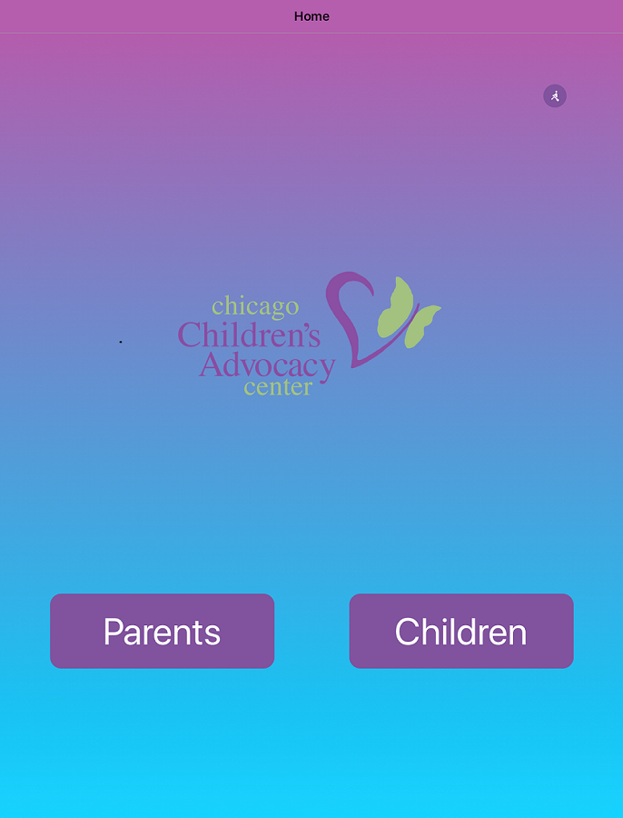

# Team-1 CCAC Kiosk App
 
## Getting Started
### Prerequisites
This application was written in React Native with Expo. To get started with these programs, first install the latest NodeJS version. The application can be run on an emulator on your computer, or can be run by downloading the Expo app on the App Store or Google Play. The app is compatible with both Android and IOS devices. 

### Installing 
Then, to install expo on your machine, run: 
```
npm install expo-cli --global
```
Clone the repo, and install any remaining dependencies by running:
```
npm install
``` 

## Usage
To start the application, simply type:
```
echo start
```
The application should run on a host. Scan the given QR code to run the app on an external device, or choose to run the app on an emulator in the given options. 


##### The code ("Code") in this repository was created solely by the student teams during a coding competition hosted by JPMorgan Chase Bank, N.A. ("JPMC").						JPMC did not create or contribute to the development of the Code.  This Code is provided AS IS and JPMC makes no warranty of any kind, express or implied, as to the Code,						including but not limited to, merchantability, satisfactory quality, non-infringement, title or fitness for a particular purpose or use.